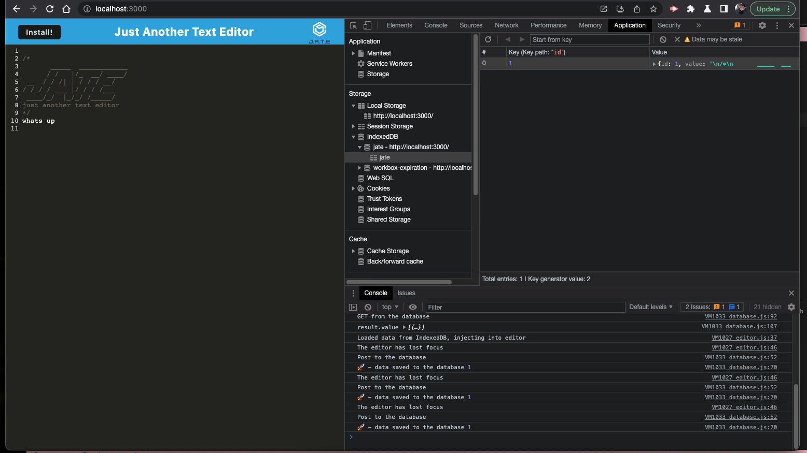
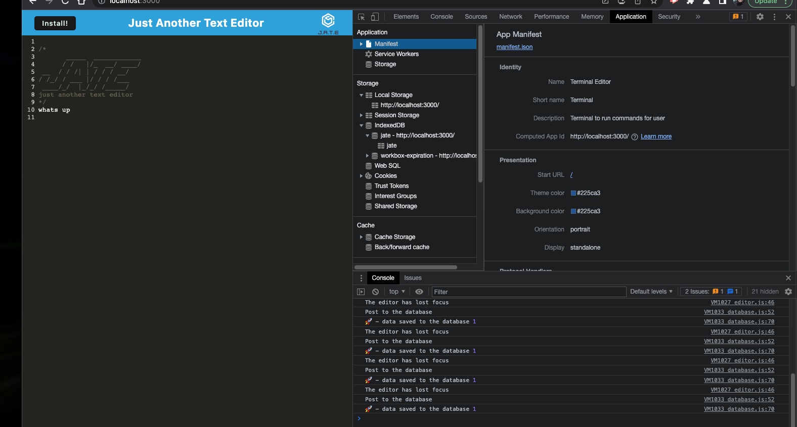
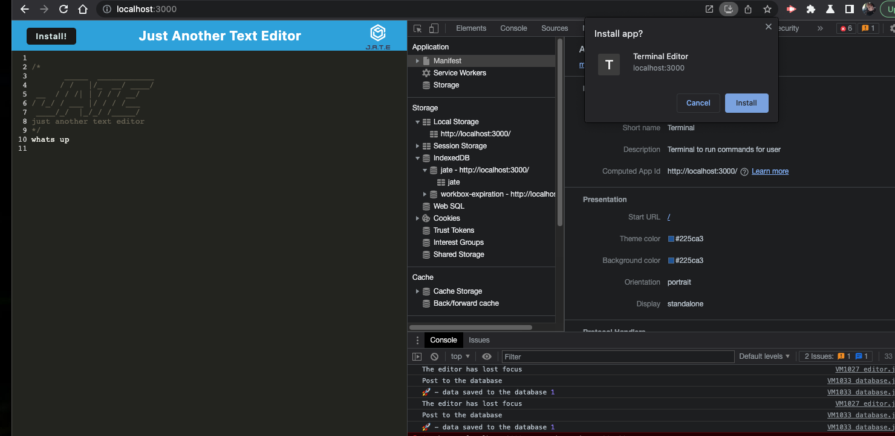
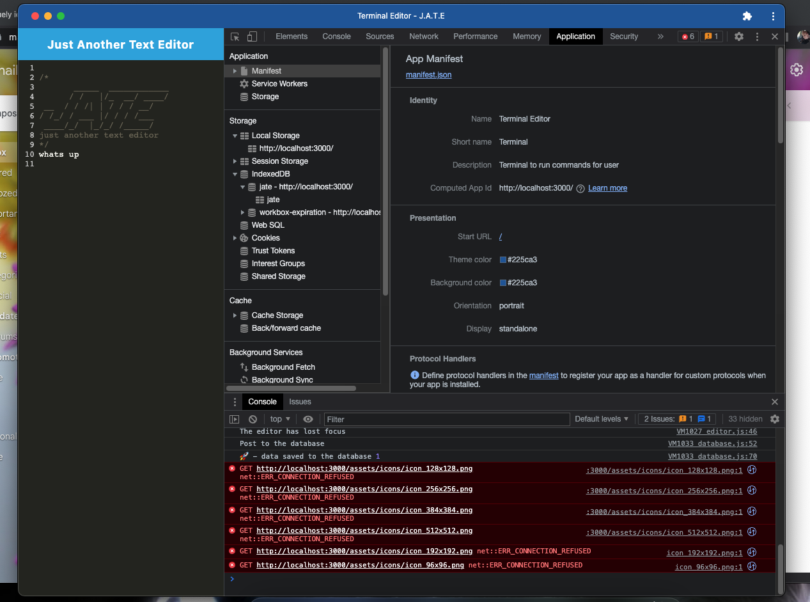
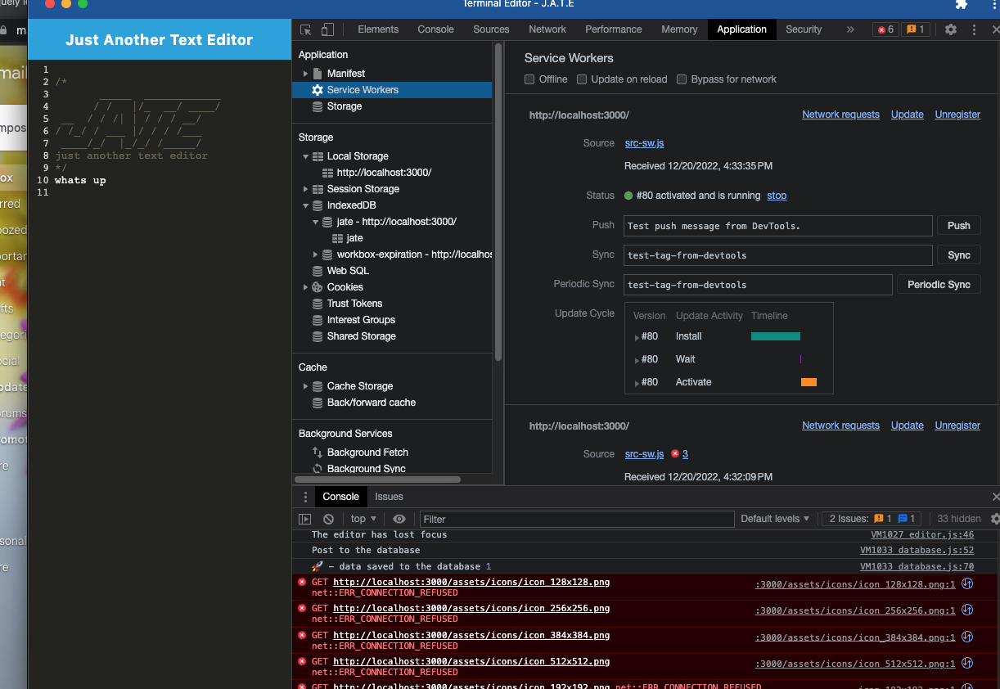

# Pwa
This project is an application that can be installed to your computer as a website terminal. It has service workers so that it can work online or offline.

## Install
To install this application you must first do an (npm i ) in the root.
Once this is done you can type (npm run start) and the template will build and generate. This will give you a link to install your template terminal.

## Mock up

github- https://github.com/mfarrell23/textPwa.git

deployed- https://textpwamb.herokuapp.com/